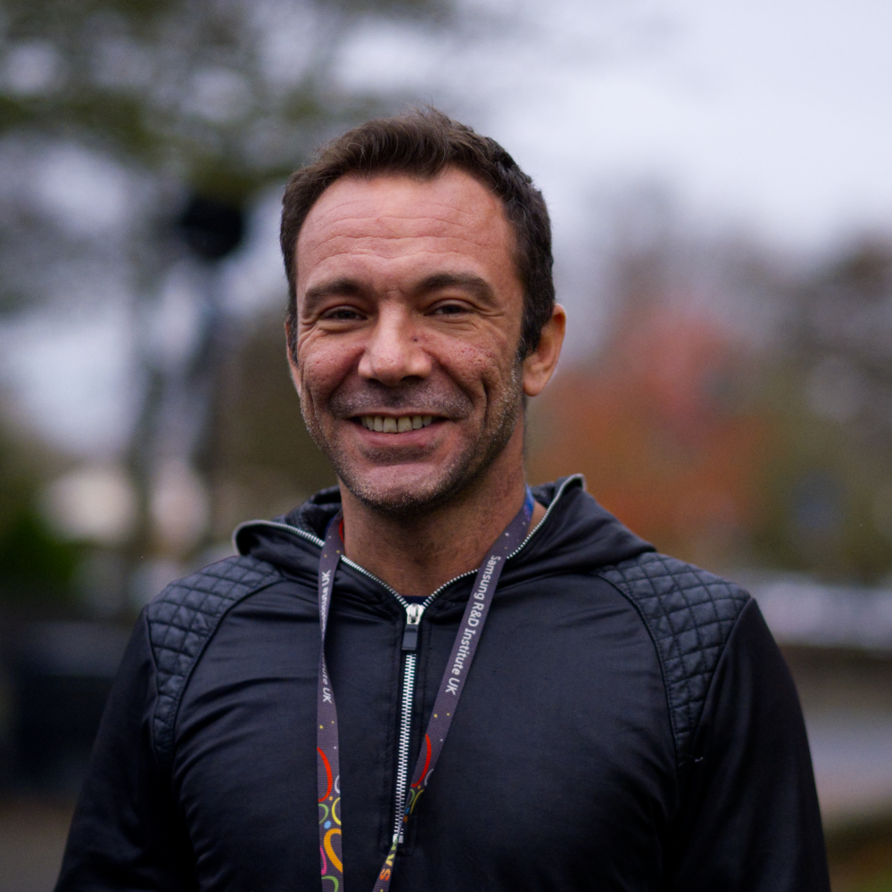
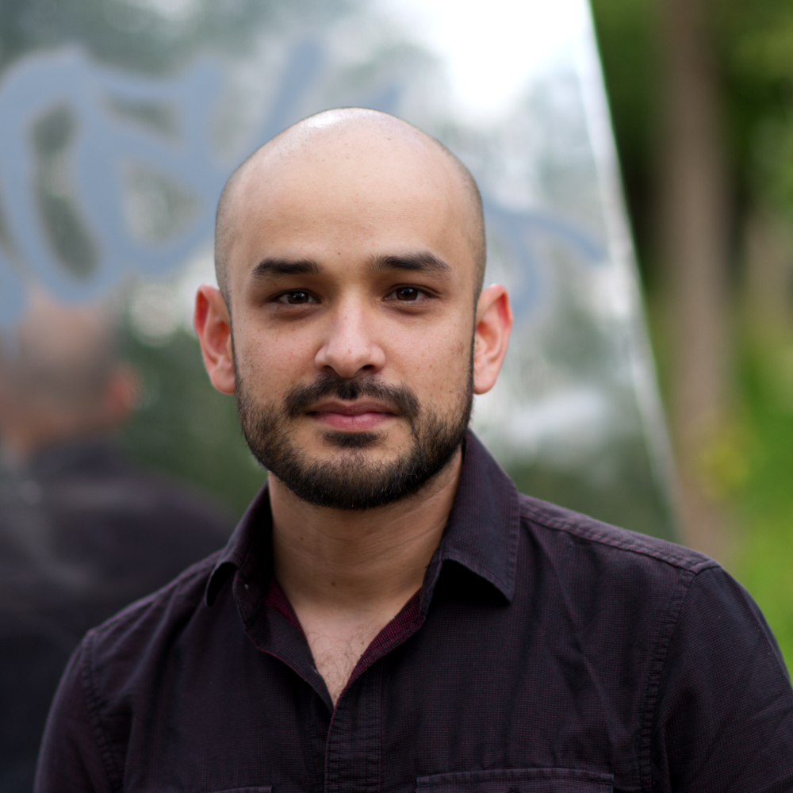
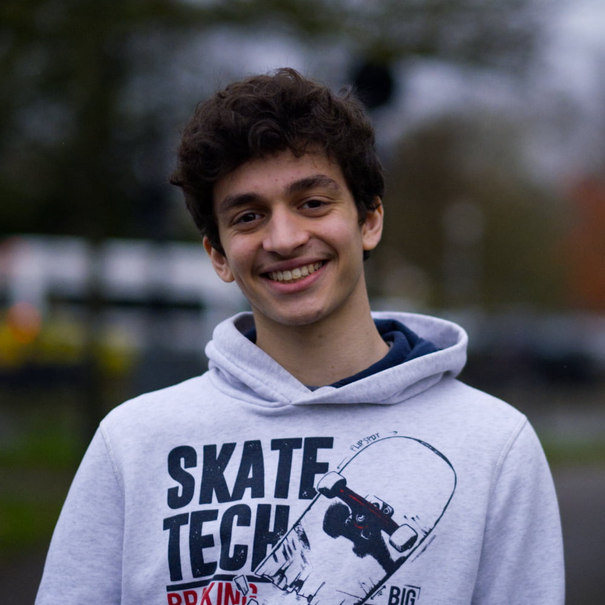

  

    <h2>Daniel Appelquist</h2>
    
Based in the UK
 
    
    
Dan is the director of Web Advocacy at Samsung Internet, co-chair of the <a href="https://w3.org/tag">Technical Architecture Group</a> at the W3C and a member of the UK Government <a href="https://www.gov.uk/government/groups/open-standards-board">Open Standards Board</a> and the <a href="https://developer.mozilla.org/en-US/docs/MDN/MDN_Product_Advisory_Board">MDN Product Advisory Board</a>. He lives and breathes the open web.

    
<a class="twitter" href="https://twitter.com/torgo">@torgo</a> <a class="mastodon" href="https://mastodon.social/@torgo">torgo@mastodon.social</a> <a class="medium" href="https://medium.com/@torgo">medium.com/@torgo</a> <a class="github" href="https://github.com/torgo">github.com/torgo</a>
 
    
#WebStandards #ProgressiveWebApps #OpenWeb #InternetPrivacy #DeveloperAdvocacy

  
 

  

    <h2>Ada Rose Cannon</h2>
    
Based in the UK

    
    
Ada Rose Cannon, is a developer advocate for the Samsung Internet Web Browser and co-chair of the W3C Immersive Web working group. Her expertise lies in Web Performance and she is passionate about VR & AR on the Web.

    
<a class="home" href="https://ada.is/">ada.is</a> <a class="twitter" href="https://twitter.com/Lady_Ada_King">@Lady_Ada_King</a> <a class="medium" href="https://medium.com/@Lady_Ada_King">medium.com/@Lady_Ada_King</a> <a class="github" href="https://github.com/AdaRoseCannon">github.com/AdaRoseCannon</a>

    
#WebVR #ProgressiveWebApps #WebPerformance

  

  

    <h2>Yannis Gravezas</h2>
    
Based in the UK

    
    
Yannis Gravezas, is a web developer advocate at Samsung Internet. He enjoys coding audiovisual applications and longs for the new, immersive, web that's emerging.

    
<a class="medium" href="https://medium.com/@wizgrav">medium.com/@wizgrav</a> <a class="github" href="https://github.com/wizgrav">github.com/wizgrav</a>

    
#WebXR #WebGL

  

  

    <h2>Diego González</h2>
    
Based in the UK

    
    
Diego is a Product Manager for Samsung Internet. He is envolved with Progressive Web Apps, WebXR, User Interfaces, obsessed with tech, gadgets, cats and baby goats.

    
<a class="home" href="https://diek.us">diek.us</a> <a class="twitter" href="https://twitter.com/diekus">@diekus</a> <a class="medium" href="https://medium.com/@diekus">medium.com/@diekus</a> <a class="github" href="https://github.com/diekus">github.com/diekus</a>

    
#WebXR #ProgressiveWebApps #CSS #BabyGoats

  

  

    <h2>Damon Hernandez</h2>
    
Based in San Francisco

    
    
WebVR @Samsung, 3D Web Ninja, VR/AR/Mixed Reality fan, built environment enthusiast & hackathon geek.

    
<a class="home" href="http://damonhernandez.blogspot.co.uk/">damonhernandez.blogspot.co.uk</a> <a class="twitter" href="https://twitter.com/metaverseone">@MetaverseOne</a> <a class="medium" href="https://medium.com/@MetaverseOne">medium.com/@MetaverseOne</a> <a class="github" href="https://github.com/Metaverse1">github.com/Metaverse1</a>

    
#WebVR #MixedReality

  

  

    <h2>Laura Morinigo</h2>
    
Based in the UK

    
    
Laura is a developer advocate at Samsung Internet. Her interests are Progressive Web Apps, emerging technologies like Voice and she loves sharing her knowledge to build more inclusive technologies.

    
<a class="twitter" href="https://twitter.com/thisislalaok">@thisislalaok</a> <a class="medium" href="https://medium.com/@thisislala">medium.com/@thisislala</a> <a class="github" href="https://github.com/lauramorinigo">github.com/lauramorinigo</a>

    
#ProgressiveWebApps #A11y #Voice

  

  

    <h2>Kevin Picchi</h2>
    
Based in the UK

    
    
El Picchi.

    
<a class="home" href="https://ada.is/">ada.is</a> <a class="twitter" href="https://twitter.com/Lady_Ada_King">@Lady_Ada_King</a> <a class="medium" href="https://medium.com/@Lady_Ada_King">medium.com/@Lady_Ada_King</a> <a class="github" href="https://github.com/AdaRoseCannon">github.com/AdaRoseCannon</a>

    
#WebVR #ProgressiveWebApps #WebPerformance

  

